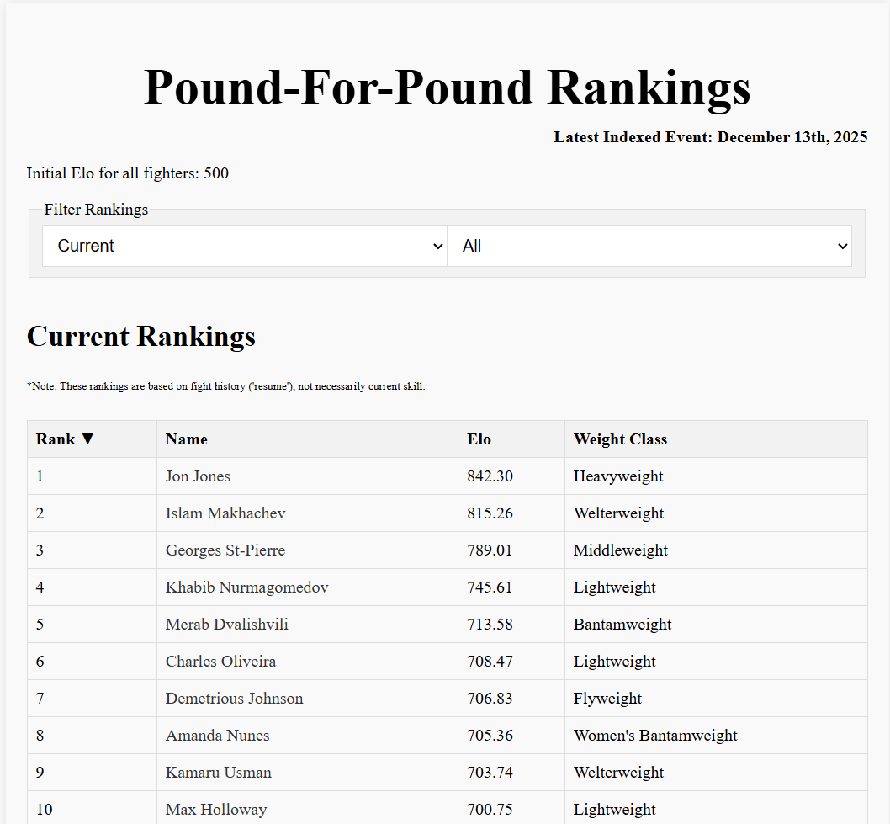
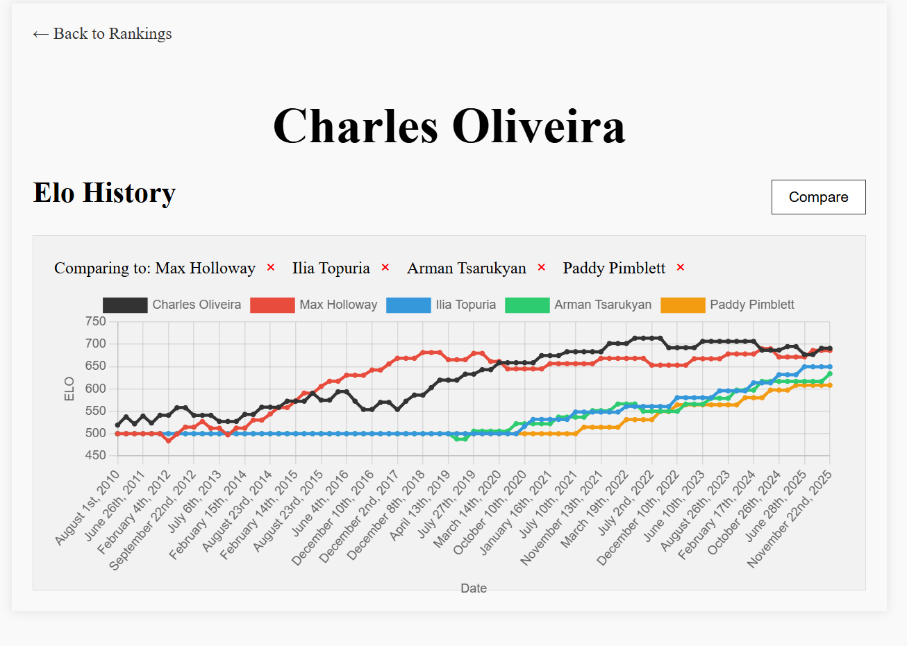

# UFC P4P Rankings

## Based on History and Math

TLDR: visit [ufc.varak.dev](https://ufc.varak.dev) to see the rankings.

Ever wondered who the best UFC fighter is, regardless of weight class? This project attempts to answer that question by using an ELO rating system based on fight history.

### Features


#### Overall Rankings



- Current Overall Rankings & change displaying order
- Historical Rankings (all time peak elos)
- Filter by Weight Class

### Comparisons



- Individual fighter pages with historical ELO graph
- Compare fighters side-by-side
- Fight history with outcomes and methods

### Process

- Make Python requests to scrape all fights from ufcstats website
- Add the fights to a csv in [data/fights.csv](data/fights.csv), with required information (some information currently not in use, but will be used to implement later features)
- Use an `elo` system to figure out the 'score' ranking of each fighter after each fight
    Note: extra points are awarded for KOs, TKOs, and submissions, as well as even more extra points when they occur before round 5.
- Sort in descending order & display on the page
- Update the data, rankings, etc. as required

### Project Structure

```md
ufc-p4p-rankings/
├── backend/
│   ├── scripts/            # Scraping fights, ELO calculation
│   └── api/                # API endpoints
|
├── data/                   # Data files (fights, fighters, elos)
|
├── frontend/
│   ├── public/             # Static assets, not needed rn 
│   │
│   └── src/                # Specific JS/CSS utilities
|
|   ├── fighter.html        # Individual fighter page
|   ├── index.html          # Main rankings page
|   ├── package-lock.json
|   ├── package.json        
│   └── vite.config.js      # Frontend dependencies
|
├── imgs/                   # Images for README
|
├── .gitignore              # Git ignore file
├── README.md               # This file
└── vercel.json             # Deployment configuration
```

### Running the Project

Requires npm and Python 3.x as prerequisites.

#### Backend Scripts

For fetching fresh/updating data:

```bash
cd backend/scripts
pip install -r requirements.txt
python scraper.py    # Update fight data
python elo.py        # Calculate ELO ratings
```

For automatically updating via API:

```bash
cd backend/api
pip install -r requirements.txt
python app.py        # Start the Flask API
```

(Will be available at `http://localhost:5000`)

#### Frontend

```bash
cd frontend
npm install
npm run dev         # Start development server
```

Visit the development server URL (shown in the terminal) to view the rankings.

For production build:
```bash
npm run build       # Builds the app for production
npm run preview     # Previews the production build locally
```
